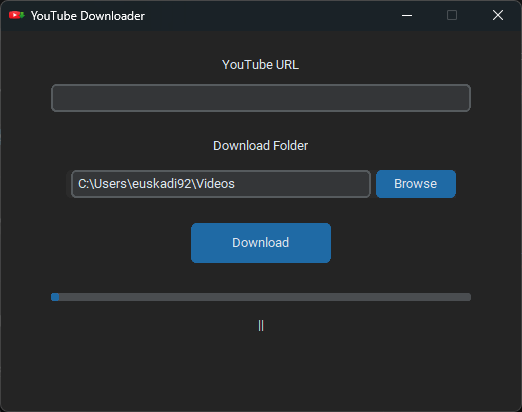

# A simple unpretentious video downloader

Simple desktop app to download YouTube videos with a simple UI.

This project was started as a necessity for my video edits when I need to download videos from Youtube but kept having issues with the online tools. These tools are great, but rarely work every time you need them. Also, it's nice to have something local on your PC.  

The core features of download are taken from the amazing yt-dlp project that you can access here: https://github.com/yt-dlp/yt-dlp. I am in no way affiliated with that project. Merely a grateful user that people invest their time in making this kind tool open to everyone. 

## Features
- Download YouTube videos in their highest quality possible
- Progress bar + speed
- Clean interface (made with the CustomTkinter framework)

## Screenshot


## Installation

```bash
pip install -r requirements.txt
python yt-downloader.py
```

As this project heavily relies on the yt-dlp project, if you encouter any issue, please refer to their documentation: https://github.com/yt-dlp/yt-dlp. 

## FAQ
If you have questions, as this is my first "public" project, please comment. 

**Q: Why did you build this?** 

**A:** On my spare time, I edit videos (literary comments, trailers, etc.) and need to download reference videos from Youtube. But the free websites are usually limited in their speed and efficiency (and sometimes return blurry errors) so I figured I would make a tool for myself, that runs locally. 

Also note that this is a training project for me to learn more about Python but also see the accuracy of the latest changes in some of the LLMs. In this instance, I have mostly used Copilot to generate some bits of code. 

**Q: The download fails at the end**

**A:** It may be due to many issues but make sure to have FFMPEG installed. Please see this part in the yt-dlp project: https://github.com/yt-dlp/yt-dlp#strongly-recommended. 

**Q: I have found a bug or have a comment**

**A:** Please share your findings with me, I want to improve this tool as much as possible, while keeping it focused on its main goal.